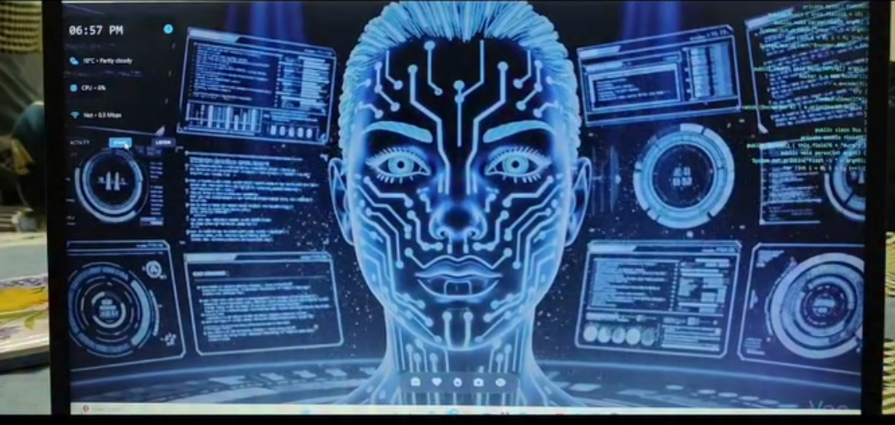

# AURA AI

> **Talk to your computer. It listens. It acts.**

`pip install aura-ai` &nbsp;·&nbsp; Windows · Python · React · Electron

[](LICENSE)
[](https://python.org)
[](https://electronjs.org)
[](https://ai.google.dev)
[](https://github.com/HariKumar-DS/aura-ai)
[](https://github.com/HariKumar-DS/aura-ai)



---

## What is it?

AURA AI is a voice-controlled personal assistant for Windows — built entirely from scratch using Python, React, and Electron.

Say it. It does it.

Send a WhatsApp message, write code, open YouTube, search the web, generate an image, manage your files — all through voice. No typing needed. Every feature you normally use your keyboard and mouse for, AURA does through your voice.

Built solo. Every bug fixed manually. Every feature shipped by one person.

---

## ✨ What's New in v0.1.0

- 🎙️ Gemini-powered TTS — natural, responsive voice output
- 🖥️ Live screen vision — AURA sees what's on your screen
- 💬 Multi-mode conversation — switch between Assistant, Agent, and Focus modes
- 📱 WhatsApp & Email automation — send messages hands-free
- 🗂️ File system control — organize, open, move, delete files by voice
- 🎨 Image generation — describe it, AURA creates it
- 💻 Live coding assistant — dictate code, AURA writes it

---

## Key Features

- **Voice-first interface** — everything happens through natural speech
- **Live screen understanding** — AURA sees your screen and responds contextually
- **Full system control** — open/close apps, manage files, handle PDFs
- **WhatsApp & Email** — send messages and emails by voice
- **Web search** — ask anything, get answers instantly
- **Image generation** — generate images from voice descriptions
- **YouTube & music** — play any song or video by just saying its name
- **Coding assistant** — dictate code, explain errors, write functions
- **PPT creation** — create presentations from voice descriptions
- **Multi-mode AI** — switch between conversation styles
- **Secure config** — API keys stored safely, not exposed

---

## How It's Wired

```
React Frontend (UI + Voice Input)
         ↕  WebSocket
Python Backend (Brain — aura_backend.py)
    ↕               ↕              ↕
Gemini API     System Control    Bridge Server
(TTS + Vision) (Files, Apps,     (bridge_server.py)
               WhatsApp, Email)
         ↕
    Electron Shell (Desktop App)
```

---

## Quickstart

### Option 1 — Use the Installer

Download the latest `.exe` from [Releases](https://github.com/HariKumar-DS/aura-ai/releases) and run it.

```
Aura Assistant Setup 0.1.0.exe
```

### Option 2 — Run from Source

```bash
# Clone the repo
git clone https://github.com/HariKumar-DS/aura-ai.git
cd aura-ai

# Backend
pip install -r requirements.txt

# Frontend
npm install
npm run dev

# Start AURA
python main.py
```

Set your API key on first launch, or configure it ahead of time:

```bash
cp .env.example .env
# Add your GEMINI_API_KEY to .env
```

---

## Usage

Speak naturally. AURA understands intent.

```bash
# Communication
"Send a WhatsApp to Rahul — I'll be late by 30 minutes"
"Email my boss the project update"

# System
"Open my Downloads folder"
"Move all PDFs from Desktop to Documents"
"Close Spotify"

# Entertainment
"Play Kesariya on YouTube"
"Search for top Python projects on GitHub"

# Creation
"Generate an image of a futuristic city at night"
"Create a 5-slide presentation on machine learning"
"Write a Python function to sort a list"

# Information
"What's the weather in Delhi?"
"Summarize this PDF"
"What's on my screen right now?"
```

---

## Modes

Switch modes with voice or the UI toggle:

| Mode | Behavior |
|------|----------|
| **Assistant** | Default — conversational, helpful responses |
| **Agent** | Executes multi-step tasks autonomously |
| **Focus** | Minimal output, only actions, no chit-chat |

---

## Tech Stack

## Tech Stack

### Frontend & Desktop
| Technology | Badge |
| :--- | :--- |
| **React** |  |
| **Electron** |  |
| **Tailwind CSS** |  |
| **Socket.io** |  |

### Backend & AI Core
| Technology | Badge |
| :--- | :--- |
| **Python** |  |
| **Google Gemini** |  |
| **OpenCV** |  |
| **SQLite** |  |

---

## Configuration

All config lives in `.env`. See [`.env.example`](.env.example) for all options.

| Variable | Description |
|----------|-------------|
| `GEMINI_API_KEY` | Your Google Gemini API key |
| `AURA_MODE` | Default mode on startup (`assistant`/`agent`/`focus`) |
| `SCREEN_CAPTURE` | Enable/disable live vision (`true`/`false`) |
| `WHATSAPP_ENABLED` | WhatsApp automation toggle |

Full reference: [docs/CONFIGURATION.md](docs/CONFIGURATION.md)

---

## Documentation

| Doc | Description |
|-----|-------------|
| [docs/ARCHITECTURE.md](docs/ARCHITECTURE.md) | System design and component breakdown |
| [docs/MODES.md](docs/MODES.md) | Mode behavior and switching |
| [docs/CONFIGURATION.md](docs/CONFIGURATION.md) | Full config reference |
| [docs/AUTOMATION.md](docs/AUTOMATION.md) | Automation capabilities and examples |

---

## Thanks

Built solo — with a lot of trial, error, and vibe coding.

Every feature shipped manually. Every bug fixed without giving up.

If AURA helped you or impressed you — a ⭐ means a lot.

---

## Contributing

See [CONTRIBUTING.md](CONTRIBUTING.md). Issues and PRs welcome.

---

## License

[MIT](LICENSE) — use it, build on it, make it yours.

---

## Star History

[](https://star-history.com/#HariKumar-DS/aura-ai&Date)
